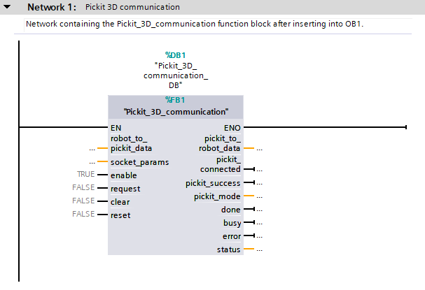
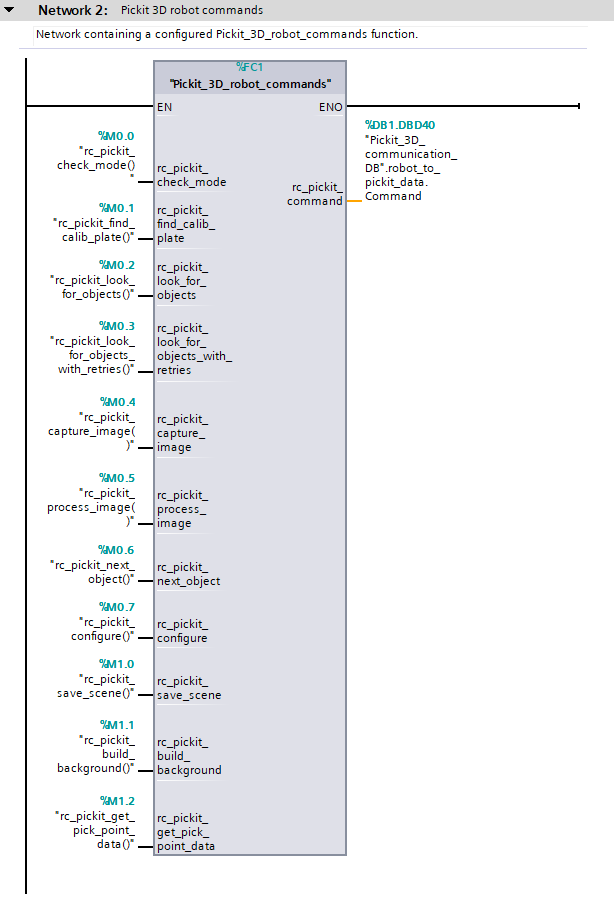

.. _siemens_pickit_interface:

Siemens Pickit interface
========================

.. _function_block_detailed:

The communication function block
--------------------------------

This section describes the Pickit communication block in detail.

The table below gives an overview of the block inputs, their datatype and the default value. The default values can be overwritten in data block. The *robot_to_pickit_data* and *socket_params* structures are elaborated below in detail.

.. table:: Inputs

   +----------------------------+-----------+----------------+---------------------------------------------------------------------------------------------------+
   | Input                      | Datatype  | Default value  | Comment                                                                                           |
   +============================+===========+================+===================================================================================================+
   | *robot_to_pickit_data*     | Struct    |                | Structure containing the data being sent from the robot.                                          |
   +----------------------------+-----------+----------------+---------------------------------------------------------------------------------------------------+
   | *socket_params*            | Struct    |                | Structure containing the TCP/IP V4 connection parameters.                                         |
   +----------------------------+-----------+----------------+---------------------------------------------------------------------------------------------------+
   | enable                     | Bool      | ``true``       | Bit that enables the block for commication, has to remain high.                                   |
   +----------------------------+-----------+----------------+---------------------------------------------------------------------------------------------------+
   | request                    | Bool      | ``false``      | Bit that initiates communcation request on **rising edge**.                                       |
   +----------------------------+-----------+----------------+---------------------------------------------------------------------------------------------------+
   | clear                      | Bool      | ``false``      | Bit that clears the *pickit_to_robot_data* memory on **rising edge**.                             |
   +----------------------------+-----------+----------------+---------------------------------------------------------------------------------------------------+
   | reset                      | Bool      | ``false``      | Bit that resets the block on **rising edge**. Established connections will be terminated.         |
   +----------------------------+-----------+----------------+---------------------------------------------------------------------------------------------------+

Similarly, an overview of the block outputs and their datatypes. The *pickit_to_robot_data* structure is elaborated below.

.. table:: Outputs

   +----------------------------+-----------+------------------------------------------------------------------------------------------------------------------+
   | Output                     | Datatype  | Comment                                                                                                          |
   +============================+===========+==================================================================================================================+
   | *pickit_to_robot_data*     | Struct    | Structure containing the data being received from Pickit.                                                        |
   +----------------------------+-----------+------------------------------------------------------------------------------------------------------------------+
   | pickit_connected           | Bool      | Bit that states if a connection with the Pickit is successfully established.                                     |
   +----------------------------+-----------+------------------------------------------------------------------------------------------------------------------+
   | pickit_success             | Bool      | Bit that states if the previous request had a succesful response.                                                |
   +----------------------------+-----------+------------------------------------------------------------------------------------------------------------------+
   | pickit_mode                | SInt      | Integer that holds the Pickit mode. Note that this holds information from the last rc_pickit_check_mode request. |
   +----------------------------+-----------+------------------------------------------------------------------------------------------------------------------+
   | done                       | Bool      | Communication job finished successfully. The bit remains high until a new job is triggered.                      |
   +----------------------------+-----------+------------------------------------------------------------------------------------------------------------------+
   | busy                       | Bool      | Active communication job. This bit will either move to done or busy.                                             |
   +----------------------------+-----------+------------------------------------------------------------------------------------------------------------------+
   | error                      | Bool      | This bit is set to high when a fatal block error occured.                                                        |
   +----------------------------+-----------+------------------------------------------------------------------------------------------------------------------+
   | status                     | Byte      | This byte gives concrete information on block status and fatal block errors/faults.                              |
   +----------------------------+-----------+------------------------------------------------------------------------------------------------------------------+

On block startup an initial *rc_pickit_check_mode()* command is executed to verify the connetion. This initial handhake sets the pickit_mode output. During runtime, this value is only reliable when consiquently requesting the *rc_pickit_check_mode()* command before reading the output. The possible values for this parameter are listed below.

 .. _pickit-mode:
 .. code-block:: python
    :caption: The Pickit mode output values

    UNDEFINED                               = -1
    ROBOT MODE                              = 0
    CALIBRATION MODE                        = 10
    IDLE                                    = 20

The different block status types are listed in the table below. All of the status variables marked as errors are considered fatal, i.e. leading to block fault and terminating the connection. These error types require a block reset by the input parameter or a total memory reset ``MRES`` of the PLC.

.. table:: Function block status overview

   +------------+-----------+-----------------------------------------------------------------------------------------------------------------+
   | status     | error     | Description                                                                                                     |
   +============+===========+=================================================================================================================+
   | ``16#00``  | 0         | No active connection.                                                                                           |
   +------------+-----------+-----------------------------------------------------------------------------------------------------------------+
   | ``16#10``  | 0         | The connection is successfully established.                                                                     |
   +------------+-----------+-----------------------------------------------------------------------------------------------------------------+
   | ``16#11``  | 1         | The established connection is lost.                                                                             |
   +------------+-----------+-----------------------------------------------------------------------------------------------------------------+
   | ``16#12``  | 1         | The received data is invalid.                                                                                   |
   +------------+-----------+-----------------------------------------------------------------------------------------------------------------+
   | ``16#1A``  | 1         | The command input number is undefined.                                                                          |
   +------------+-----------+-----------------------------------------------------------------------------------------------------------------+
   | ``16#1B``  | 1         | Pickit is not in robot mode.                                                                                    |
   +------------+-----------+-----------------------------------------------------------------------------------------------------------------+
   | ``16#1C``  | 0         | Pickit is not in calibration mode.                                                                              |
   +------------+-----------+-----------------------------------------------------------------------------------------------------------------+
   | ``16#40``  | 1         | Timeout error, cannot establish a connection.                                                                   |
   +------------+-----------+-----------------------------------------------------------------------------------------------------------------+
   | ``16#41``  | 1         | Timeout error, the connection was established but the initial handshake failed.                                 |
   +------------+-----------+-----------------------------------------------------------------------------------------------------------------+
   | ``16#42``  | 1         | Timeout error, the connection was established but there was no data received as a response to the send request. |
   +------------+-----------+-----------------------------------------------------------------------------------------------------------------+

The communication is internally set up with the ``TSEND_C`` and ``TRCV_C`` standard function blocks. For detailed status information on the connection, these internal blocks need to be monitored. Detailed information can be found in the `Siemens S7-1200 Programmable controller System Manual`.

.. _siemens_robot_to_pickit_data:

Robot to Pickit data
^^^^^^^^^^^^^^^^^^^^
The *robot_to_pickit_data* structure contains all parameters that make up the send message of 48 bytes. The *robot_to_pickit_data* structure is not an identical copy of the actual sent message structure to the robot. Detailed information about the message structure can be found in `the socket communcation article`.

.. table:: robot_to_pickit_data

   +----------------------------+-----------+----------------+---------------------------------------------------------------------------------------------------+
   | robot_to_pickit_data       | Datatype  | Default value  | Comment                                                                                           |
   +============================+===========+================+===================================================================================================+
   | RobotPose.X                | Real      | ``0.0``        | Registers containing the robot pose X translation in m.                                           |
   +----------------------------+-----------+----------------+---------------------------------------------------------------------------------------------------+
   | RobotPose.Y                | Real      | ``0.0``        | Registers containing the robot pose Y translation in m.                                           |
   +----------------------------+-----------+----------------+---------------------------------------------------------------------------------------------------+
   | RobotPose.Z                | Real      | ``0.0``        | Registers containing the robot pose Z translation in m.                                           |
   +----------------------------+-----------+----------------+---------------------------------------------------------------------------------------------------+
   | RobotPose.A                | Real      | ``0.0``        | Registers containing the robot pose A rotation in deg.                                            |
   +----------------------------+-----------+----------------+---------------------------------------------------------------------------------------------------+
   | RobotPose.B                | Real      | ``0.0``        | Registers containing the robot pose B rotation in deg.                                            |
   +----------------------------+-----------+----------------+---------------------------------------------------------------------------------------------------+
   | RobotPose.C                | Real      | ``0.0``        | Registers containing the robot pose C rotation in deg.                                            |
   +----------------------------+-----------+----------------+---------------------------------------------------------------------------------------------------+
   | RobotPose.D                | Real      | ``0.0``        | Registers containing the robot pose D rotation in deg.                                            |
   +----------------------------+-----------+----------------+---------------------------------------------------------------------------------------------------+
   | Payload.SetupId            | DInt      | ``1``          | ID of the setup configuration when requesting ``rc_pickit_configure()``.                          |
   +----------------------------+-----------+----------------+---------------------------------------------------------------------------------------------------+
   | Payload.ProductId          | DInt      | ``1``          | ID of the product configuration when requesting ``rc_pickit_configure()``.                        |
   +----------------------------+-----------+----------------+---------------------------------------------------------------------------------------------------+
   | Payload.DetectionRetries   | DInt      | ``0``          | Maximum number of detection retries when requesting ``rc_pickit_look_for_objects_with_retries()``.|
   +----------------------------+-----------+----------------+---------------------------------------------------------------------------------------------------+
   | Command                    | DInt      | ``0``          | Pickit robot command number.                                                                      |
   +----------------------------+-----------+----------------+---------------------------------------------------------------------------------------------------+
   | MetaData.RobotType         | DInt      | ``5``          | Orientation convention dependent on robot brand.                                                  |
   +----------------------------+-----------+----------------+---------------------------------------------------------------------------------------------------+
   | MetaData.InterfaceVersion  | DInt      | ``11``         | Pickit socket interface version ``1.1``.                                                          |
   +----------------------------+-----------+----------------+---------------------------------------------------------------------------------------------------+

The ``robot_to_pickit_data.RobotPose`` is part of each message to the Pickit system. We use these values for:

1. Robot-camera calibration
2. Object pose calculation w.r.t. robot base in a camera to robot mount setup
3. Robot pose visualization in the Pickit UI.

Therefore does each individual request require the actual robot pose. Furthermore, sending a message to the Pickit system requires setting a specific robot command number in the ``robot_to_pickit_data.Command`` variable. An overview of all possible Pickit command numbers can be found in the list below.

 .. _siemens_request-cmds:
 .. code-block:: python
    :caption: Request command constants

    RC_PICKIT_NO_COMMAND                    = -1
    RC_PICKIT_CHECK_MODE                    = 0
    RC_PICKIT_FIND_CALIB_PLATE              = 10
    RC_PICKIT_LOOK_FOR_OBJECTS              = 20
    RC_PICKIT_LOOK_FOR_OBJECTS_WITH_RETRIES = 21
    RC_PICKIT_CAPTURE_IMAGE                 = 22
    RC_PICKIT_PROCESS_IMAGE                 = 23
    RC_PICKIT_NEXT_OBJECT                   = 30
    RC_PICKIT_CONFIGURE                     = 40
    RC_PICKIT_SAVE_SCENE                    = 50
    RC_PICKIT_BUILD_BACKGROUND              = 60
    RC_PICKIT_GET_PICK_POINT_DATA           = 70

.. warning:: Undefined command numbers will lead to block fault, which is considered a fatal error and terminating the connection.

.. _socket_params:

Socket parameters
^^^^^^^^^^^^^^^^^

The socket parameters structure contains all parameters to set up the TCP/IP connection from the PLC to the Pickit system.

.. table:: socket_params

   +----------------------------+-----------+----------------+---------------------------------------------------------------------------------------------------+
   | socket_params              | Datatype  | Default value  | Comment                                                                                           |
   +============================+===========+================+===================================================================================================+
   | ConnectionId               | Word      | ``16#0001``    | Connection identifier in TIA. When having multiple connections, use the next free id.             |
   +----------------------------+-----------+----------------+---------------------------------------------------------------------------------------------------+
   | RemoteAddress[0]           | USInt     | ``169``        | First octet of the Pickit IP address.                                                             |
   +----------------------------+-----------+----------------+---------------------------------------------------------------------------------------------------+
   | RemoteAddress[1]           | USInt     | ``254``        | Second octet of the Pickit IP address.                                                            |
   +----------------------------+-----------+----------------+---------------------------------------------------------------------------------------------------+
   | RemoteAddress[2]           | USInt     | ``5``          | Third octet of the Pickit IP address.                                                             |
   +----------------------------+-----------+----------------+---------------------------------------------------------------------------------------------------+
   | RemoteAddress[3]           | USInt     | ``182``        | Fourth octet of the Pickit IP address.                                                            |
   +----------------------------+-----------+----------------+---------------------------------------------------------------------------------------------------+
   | RemotePort[0]              | USInt     | ``16#13``      | First octet of the Pickit IP address.                                                             |
   +----------------------------+-----------+----------------+---------------------------------------------------------------------------------------------------+
   | RemotePort[1]              | USInt     | ``16#89``      | First octet of the Pickit IP address.                                                             |
   +----------------------------+-----------+----------------+---------------------------------------------------------------------------------------------------+
   | Timeout                    | IEC time  | ``T#4s``       | Communication timeout.                                                                            |
   +----------------------------+-----------+----------------+---------------------------------------------------------------------------------------------------+
   | Heartbeat                  | IEC time  | ``T#100ms``    | Specifies the time between each rc_pickit_no_command(), default 100 ms.                           |
   +----------------------------+-----------+----------------+---------------------------------------------------------------------------------------------------+

The ``socket_params.ConnectionId`` parameter describes the hardware connection indentifier. The default value is set at `1`, however, with multiple Profinet connections this number might change and can be found under *Device settings*. The ``socket_params.Timeout`` input specifies the timeframe the PLC has for receiving messages from Pickit. When this timeframe is exceeded, the block faults. The ``socket_params.Heartbeat`` input specifies the heartbeat time. The Pickit system expects information, i.e. the robot pose, from the PLC each given timestamp. This information is necessary for the visualisation of the robot pose within the Pickit UI. Setting this value to 0 will not update the robot pose.

.. _pickit_to_robot_data:

Pickit to robot data
^^^^^^^^^^^^^^^^^^^^

The *pickit_to_robot_data* structure contains all parameters that make up the receive message of 64 bytes. The output structure in the DB is not identical to the actual received message structre. Detailed information of the receive message can be found in `the socket communcation article?`.

.. table:: pickit_to_robot_data

   +---------------------------------+-----------+---------------------------------------------------------------------------------------------------------------------------------------------------+
   | pickit_to_robot_data            | Datatype  | Comment                                                                                                                                           |
   +=================================+===========+===================================================================================================================================================+
   | RobotPose.X                     | Real      | Object translation X in m.                                                                                                                        |
   +---------------------------------+-----------+---------------------------------------------------------------------------------------------------------------------------------------------------+
   | RobotPose.Y                     | Real      | Object translation Y in m.                                                                                                                        |
   +---------------------------------+-----------+---------------------------------------------------------------------------------------------------------------------------------------------------+
   | RobotPose.Z                     | Real      | Object translation Z in m.                                                                                                                        |
   +---------------------------------+-----------+---------------------------------------------------------------------------------------------------------------------------------------------------+
   | RobotPose.A                     | Real      | Object rotation A in deg.                                                                                                                         |
   +---------------------------------+-----------+---------------------------------------------------------------------------------------------------------------------------------------------------+
   | RobotPose.B                     | Real      | Object rotation B in deg.                                                                                                                         |
   +---------------------------------+-----------+---------------------------------------------------------------------------------------------------------------------------------------------------+
   | RobotPose.C                     | Real      | Object rotation C in deg.                                                                                                                         |
   +---------------------------------+-----------+---------------------------------------------------------------------------------------------------------------------------------------------------+
   | RobotPose.D                     | Real      | Object rotation D in deg.                                                                                                                         |
   +---------------------------------+-----------+---------------------------------------------------------------------------------------------------------------------------------------------------+
   | PickPointOffset.X               | Real      | Pick point offset translation X in m.                                                                                                             |
   +---------------------------------+-----------+---------------------------------------------------------------------------------------------------------------------------------------------------+
   | PickPointOffset.Y               | Real      | Pick point offset translation Y in m.                                                                                                             |
   +---------------------------------+-----------+---------------------------------------------------------------------------------------------------------------------------------------------------+
   | PickPointOffset.Z               | Real      | Pick point offset translation Z in m.                                                                                                             |
   +---------------------------------+-----------+---------------------------------------------------------------------------------------------------------------------------------------------------+
   | PickPointOffset.A               | Real      | Pick point offset rotation A in deg.                                                                                                              |
   +---------------------------------+-----------+---------------------------------------------------------------------------------------------------------------------------------------------------+
   | PickPointOffset.B               | Real      | Pick point offset rotation B in deg.                                                                                                              |
   +---------------------------------+-----------+---------------------------------------------------------------------------------------------------------------------------------------------------+
   | PickPointOffset.C               | Real      | Pick point offset rotation C in deg.                                                                                                              |
   +---------------------------------+-----------+---------------------------------------------------------------------------------------------------------------------------------------------------+
   | PickPointOffset.D               | Real      | Pick point offset rotation D in deg.                                                                                                              |
   +---------------------------------+-----------+---------------------------------------------------------------------------------------------------------------------------------------------------+
   | Payload.ObjectAge               | Real      | The duration (in seconds) elapsed between the capturing of the camera image and the moment the object information is sent to the robot.           |
   +---------------------------------+-----------+---------------------------------------------------------------------------------------------------------------------------------------------------+
   | Payload.ObjectType              | UDInt     | For a Teach detection, this field contains the model ID of the current object. For a Flex/Pattern detection, this field contains the object type. |
   +---------------------------------+-----------+---------------------------------------------------------------------------------------------------------------------------------------------------+
   | Payload.ObjectDimensions.Length | Real      | Object length (SQUARE, RECTANGLE, ELLIPSE, CYLINDER, POINTCLOUD, BLOB) or diameter (CIRCLE, SPHERE) in meters.                                    |
   +---------------------------------+-----------+---------------------------------------------------------------------------------------------------------------------------------------------------+
   | Payload.ObjectDimensions.Width  | Real      | Object width (RECTANGLE, ELLIPSE, POINTCLOUD, BLOB) or diameter (CYLINDER) in meters.                                                             |
   +---------------------------------+-----------+---------------------------------------------------------------------------------------------------------------------------------------------------+
   | Payload.ObjectDimensions.Height | Real      | Object height (POINTCLOUD, BLOB) in meters.                                                                                                       |
   +---------------------------------+-----------+---------------------------------------------------------------------------------------------------------------------------------------------------+
   | Payload.ObjectsRemaining        | UDInt     | If this field is non-zero, it contains the number of remaining objects that can be retrieved via consecutive RC_PICKIT_NEXT_OBJECT requests.      |
   +---------------------------------+-----------+---------------------------------------------------------------------------------------------------------------------------------------------------+
   | Payload.ReferencePickPointID    | UDInt     | ID of the selected pick point’s reference pick point.                                                                                             |
   +---------------------------------+-----------+---------------------------------------------------------------------------------------------------------------------------------------------------+
   | Payload.SelectedPickPointID     | UDInt     | ID of the pick point that was selected for the given object.                                                                                      |
   +---------------------------------+-----------+---------------------------------------------------------------------------------------------------------------------------------------------------+
   | Status                          | DInt      | The Pickit response status number.                                                                                                                |
   +---------------------------------+-----------+---------------------------------------------------------------------------------------------------------------------------------------------------+
   | MetaData.RobotType              | DInt      | The confirmed orientation convention dependent on robot brand.                                                                                    |
   +---------------------------------+-----------+---------------------------------------------------------------------------------------------------------------------------------------------------+
   | MetaData.InterfaceVersion       | DInt      | The confirmed Pickit socket interface version.                                                                                                    |
   +---------------------------------+-----------+---------------------------------------------------------------------------------------------------------------------------------------------------+

The ``pickit_to_robot_data.ObjectPose`` holds the object pose expressed to robot base frame. The orientation convention is determined by the ``robot_to_pickit_data.MetaData.RobotType`` parameter in the input section. More information on supported robot brands and their orientation conventions in the socket communication article. The ``robot_to_pickit_data.PickPointOffset`` contains the offset transformation w.r.t. the reference pick point set inside the Pickit system. To obtain both the ``robot_to_pickit_data.ObjectPose`` and ``robot_to_pickit_data.PickPointOffset`` you need to subsequently request a *rc_pickit_find_objects()* and *rc_pickit_get_pick_point_data()* in order.

.. note:: The orientation of the object is expressed in compliance with the Pickit UI. This is having the ``pickit_to_robot_data.ObjectPose.Z`` axis is pointing up and/or outwards. It might be necessary to apply an additional 180 degrees rotation around the ``pickit_to_robot_data.ObjectPose.X`` axis to have the robot TCP aligning with the object pose.

.. warning:: The ``pickit_to_robot_data.ObjectPose`` variable is **not** validated on reachability, i.e. is the object within reach of the robot. This is dependent on each different robot brand/type and is **advised** to be validated before moving to this position.

The response message from Pickit contains a feedback constant, found in ``pickit_to_robot_data.Status``. The possible constants received back are expressed in the list below.

 .. _siemens_response-status:
 .. code-block:: python
    :caption: Response status constants

    PICKIT_UNKNOWN_COMMAND                  = -99
    PICKIT_ROBOT_MODE                       =   0
    PICKIT_IDLE_MODE                        =   1
    PICKIT_CALIBRATION_MODE                 =   2
    PICKIT_FIND_CALIB_PLATE_OK              =  10
    PICKIT_FIND_CALIB_PLATE_FAILED          =  11
    PICKIT_OBJECT_FOUND                     =  20
    PICKIT_NO_OBJECTS                       =  21
    PICKIT_NO_IMAGE_CAPTURED                =  22
    PICKIT_EMPTY_ROI                        =  23
    PICKIT_IMAGE_CAPTURED                   =  26
    PICKIT_CONFIG_OK                        =  40
    PICKIT_CONFIG_FAILED                    =  41
    PICKIT_SAVE_SNAPSHOT_OK                 =  50
    PICKIT_SAVE_SNAPSHOT_FAILED             =  51
    PICKIT_BUILD_BKG_CLOUD_OK               =  60
    PICKIT_BUILD_BKG_CLOUD_FAILED           =  61
    PICKIT_GET_PICK_POINT_DATA_OK           =  70
    PICKIT_GET_PICK_POINT_DATA_FAILED       =  71

The robot commands function
---------------------------

This section describes the Pickit robot commands function in detail.

This function calculates the Pickit command number from simple boolean inputs. The inputs for the block are all Boolean datatype that can be linked to individual bit memory. The output is a DInt containing the command number which can be directly linked to the Pickit communcation DB output for the ``robot_to_pickit_data.Command`` parameter. The block is **optional**.

.. warning:: Note that if two inputs are set high, the block outputs an undefined command number which can possibly result in block fault. Therefore it is mandatory to **only set one input high** each time.
